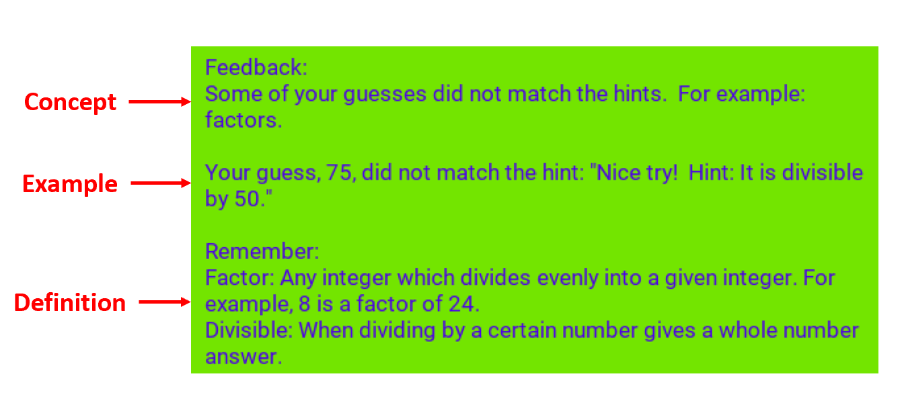
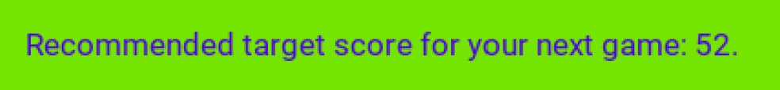
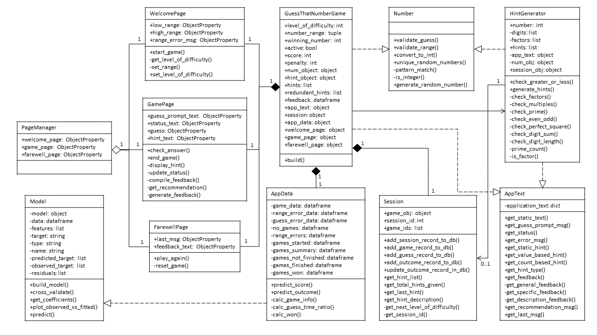

# Guess That Number

## Overview
Guess That Number is a game I built in Python.  The original version uses the Tkinter library, while the updated version uses Kivy.  The object of the game is to guess a number between a specific range in as few tries as possible, using the hints given.  It has 3 levels of difficulty and an ability to set a custom range if the user chooses.  It also provides feedback and recommendations based on the user's performance.

  

## Files
Here are the relevant files for this application:
- [**README**](https://github.com/albert-ntiri/guess_that_number/blob/main/README.md): This file contains a high-level walkthrough of the project.

**CURRENT CODE BASE**
- [**Current Code Base**](https://github.com/albert-ntiri/guess_that_number/blob/main/version_3/main)

**VERSIONS**
- VERSION 1: Version 1 is the proof of concept that implements the basic functionality and UI design, using Tkinter.
- VERSION 2: Version 2 adds a database and machine learning to implement recommendations based on predicted scores and outcomes, as well as using Kivy for the UI, in place of Tkinter, for the ability to work on mobile platforms.
- VERSION 3: Version 3 refactors the code to implement SOLID principles and design patterns to improve the design and make it more flexible.

## Application Structure
This application has 3 pages:
- **Welcome Page**: This is the landing page for the application.  It consists of a description of the game, options for selecting a level of difficulty or inputting a custom range, and a play button to start the game.

   

- **Game Page**: This is the page the user sees while actively playing the game.  It consists of text indicating the range containing the winning number, the number of guesses the user has remaining, an entry box for the user to type a number, hints that display if the user guesses incorrectly, and buttons to submit their guess or quit the game.

   

- **Farewell Page**: This is the final page the user sees once the game has ended.  It consists of a message that displays based on the outcome of the game, feedback with either a refresher on math concepts or a recommendation for the next game, and a button to play again if the user chooses.

   

## Personalization
There are 2 components of this application that provide a personalized experience for users: feedback and recommendations.

### Feedback
If a user is given a hint and then enters a guess that is inconsistent with that hint, the application keeps track of that and provides feedback to the user after the game is completed.  That feedback includes the relevant concept, the specific example, and a definition of that concept, which was scraped from 2 math websites: www.mathisfun.com and www.mathwords.com.  If there were multiple mistakes, the most prominent one is displayed.

  

### Recommendations
The application uses a regression model to predict the score of a game, along with a classification model to predict its outcome.  Once the user finishes a game, these models make predictions based on that game's data and compares it to the user's performance.

These predictions are determined using the following features:
- **range size**: how many numbers the range contains
- **total hints**: the number of hints provided during a game
- **total duration**: how long the user took to play the game
- **guess time ratio**: a ratio of the longest time before a guess to the shortest time before a guess *(this is only used to predict a score)*

From that, the application provides a recommendation to the user for their next game.  That can come in the form of a target score or the next highest level of difficulty to try.

  

## Code Structure
The code follows an object-oriented programming format.  Version 2 consists of 11 classes; version 1 consists of 10.  *Note: The sections below describe the classes in version 2 of the application.*

### UML Class Diagram

  

### Class Descriptions
Here is a brief description of each class:
- **Number**: This class validates user entries from both the custom range and guess fields to determine whether they are integers, if the range is ordered properly, and if the guesses match the corresponding hints.  It also generates random numbers, which are used to select a winning number and pick some of the hints.
- **HintGenerator**: This class takes the winning number and uses it to generate a list of hints.  These hints include but are not limited to prime numbers, factors, multiples, and characteristics about the digits.
- **WelcomePage**: This class allows users to select a level of difficulty, enter a custom range, and start the game.
- **GamePage**: This class operates the game, including accepting users' guesses and evaluating them, updating the score, displaying hints and the number of guesses remaining, and providing options to submit a guess or quit the game.
- **FarewellPage**: This class displays the final screen with the thank you message, feedback or recommendations to the user, and an option to play again.
- **PageManager**: This class defines the pages of the application and allows for switching between which displays on the screen.
- **AppText**: This class serves as a centralized location for the text displayed on the application.  It contains a dictionary attribute with all of that text, along with methods for other classes to retrieve specific text.
- **Session**: This class tracks and stores data from the application.  It enters this data into a database and pulls data from the database as needed.
- **AppData**: This class uses historical data from the application to make predictions on users' games and come up with recommendations to users based on their performance.
- **Model**: This class provides the functionality to build machine learning models used for making predictions on games.
- **GuessThatNumberGame**: This class builds the application and stores the main attributes for the games, which are used and updated by the 3 page classes: WelcomePage, GamePage, and FarewellPage.

## Process
To develop this app, I followed a process that included 4 main steps:
1. Develop the back end.
2. Design the front end.
3. Connect the front and back ends.
4. Refactor.

### 1. Develop the back end.
The first step was figuring out how the game was going to work.  During this step, I laid out 2 classes: 1 for carrying out the logic of the game and 1 for generating the hints.  The logic of the game included setting a range, picking a winning number, checking answers, and establishing a scoring system, resulting in the Game class.  I put the logic for generating hints into a separate class because there were a variety of ways to come up with a hint, which could result in a lot of code just for hints so I thought it best to isolate that in its own class.

### 2. Design the front end.
Once I established the logic for the game, I proceeded to build an interface for it.  This began with conceptualizing the number of pages and how each page might look, and then proceeding to build each one separately.  The design was based on how the game works.  For example, at minimum, there needed to be a button to start the game, along with one for submitting a guess.  Similarly, there needed to be an entry field where users could type in their guess, along with text displaying the range to guess from and the hints as they were provided.

### 3. Connect the front and back ends.
After finishing the back end and front end logic, separately, the next step was to figure out how to get them to work together.  This included things like getting the application to show the next page at the appropriate time, getting the right text to display when and where it was supposed to, and laying out the process for opening and playing the game in such a way that there were no dependency issues.  During this step, I also converted the logic from step 2 into object-oriented programming format.  This resulted in the Page, WelcomePage, GamePage, FarewellPage, and AppManager classes.

### 4. Refactor.
At this point, I was able to run the game successfully without any major bugs preventing a full game from being played.  From there, I went back and relooked at everything, searching for ways to make it better, more efficient, and more reliable.  In this step, I identified operations I was performing multiple times in different places and turned them into methods.  I also discovered opportunities to add new attributes that simplified the logic of some of the methods, making them more clean and readable.  I also cleaned up the pages but separating the header into its own class and made the decision to move all of the text to a centralized location instead of hardcoding it in various places.  This resulted in the Number, Header, and AppText classes.

## Testing
Testing was a major component of developing this application.  I initially tested it manually, which included a series of steps, starting from the micro-level and gradually increasing the scope.

### Unit Testing
At the lowest level, I verified each individual piece of functionality one by one to make sure it was working.  This included every attribute and method of each class.  If a method was not behaving as expected, I sometimes converted it into a function outside of the class to get it working before returning to the method.

### Methods That Call Other Methods or Use Multiple Attributes Within a Class
Once everything was working on the micro level, I tested more complex methods, either because they used multiple attributes or called other methods from that class.  From there, I continued this process until I reached the highest-level methods within each class.

### Interaction Between Classes
After I tested everything within each class, the next step was to focus on interactivity between classes.  This primarily composed of 2 things: methods that accessed an attribute from a different class and methods that called a method from a different class.  Much of connecting the front and back ends fell into this step.

### Running the Whole Game
Finally, I ran the whole game several times, looking at everything in context.  This step required running through multiple scenarios:
- Checking each level of difficulty
- Trying out different custom ranges
- Purposefully inputting invalid entries to verify the appropriate error was being displayed
- Winning, losing, and quitting the game to see each experience in action
- Getting different types of winning numbers and verifying the accuracy and utility of the hints.

Most of the refactoring ideas emerged from this step.

After completing manual testing, I created automated unit tests to speed up subsequent testing after changes.
