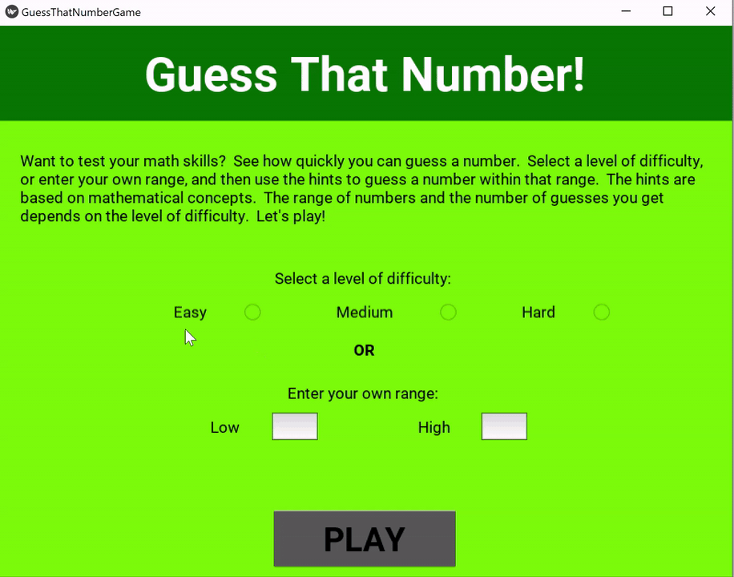
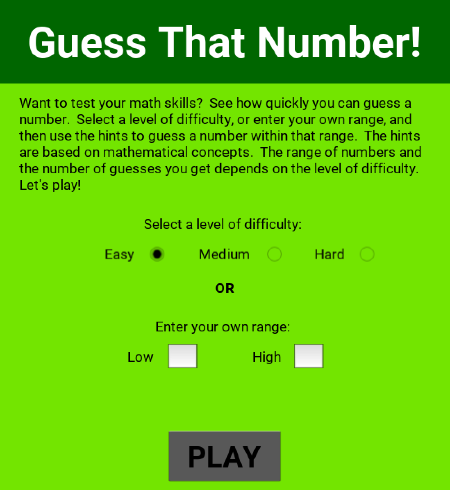
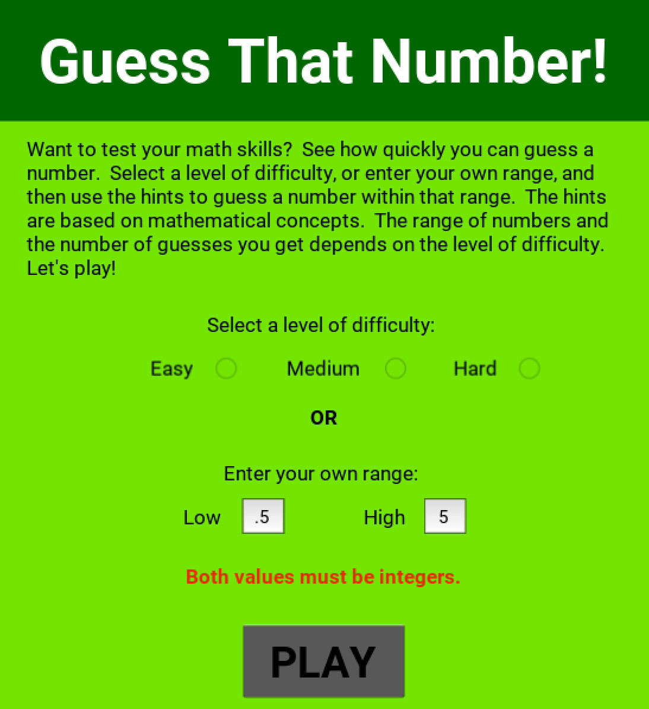
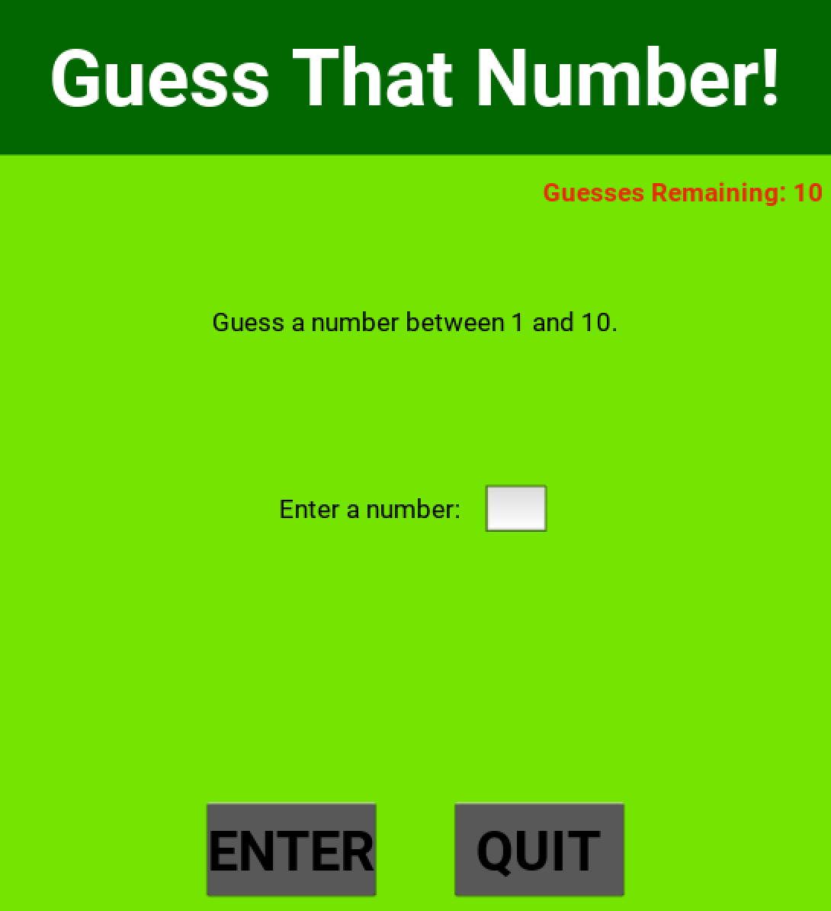
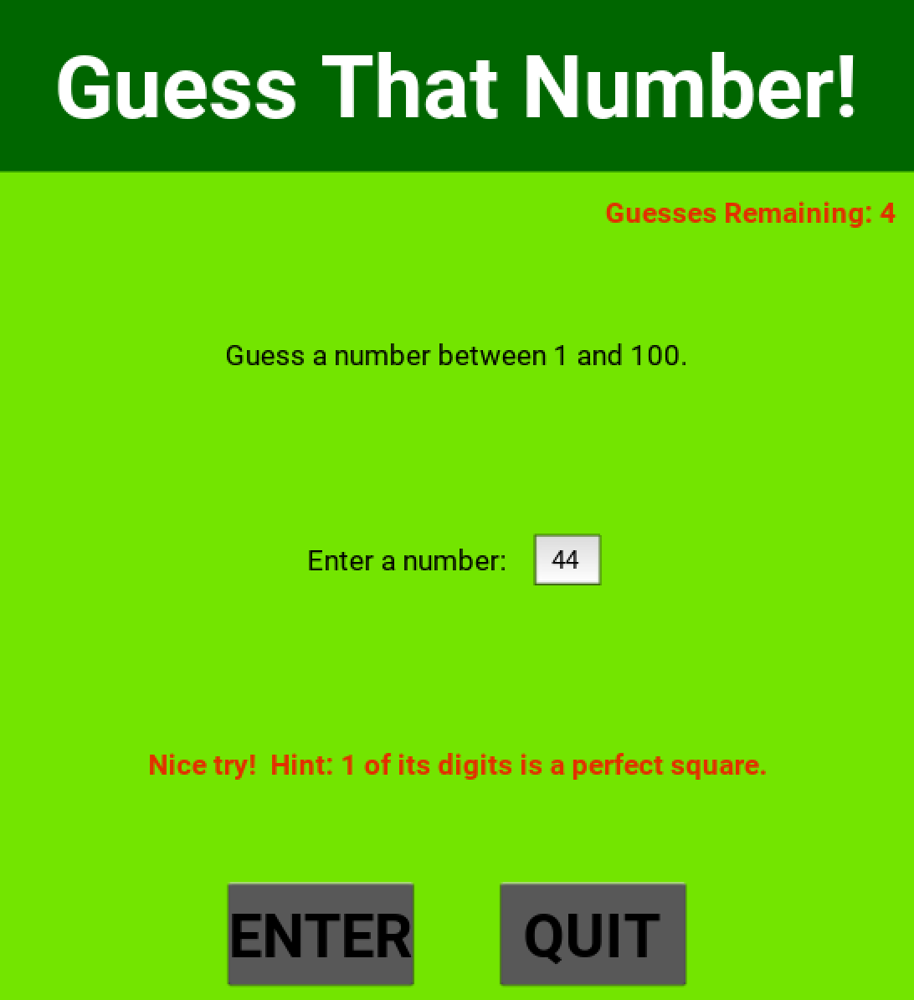
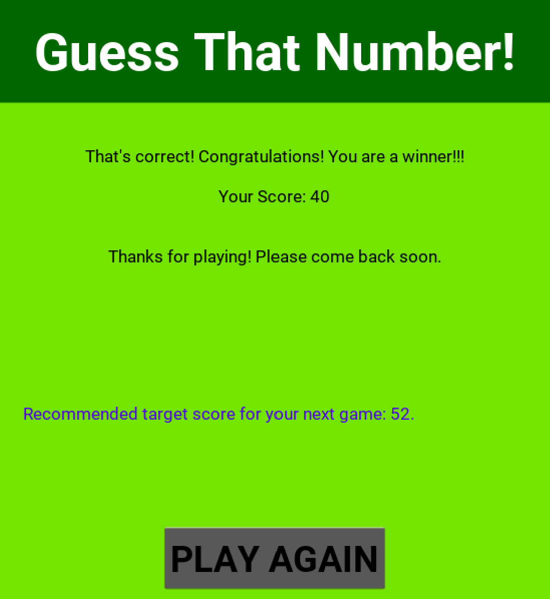
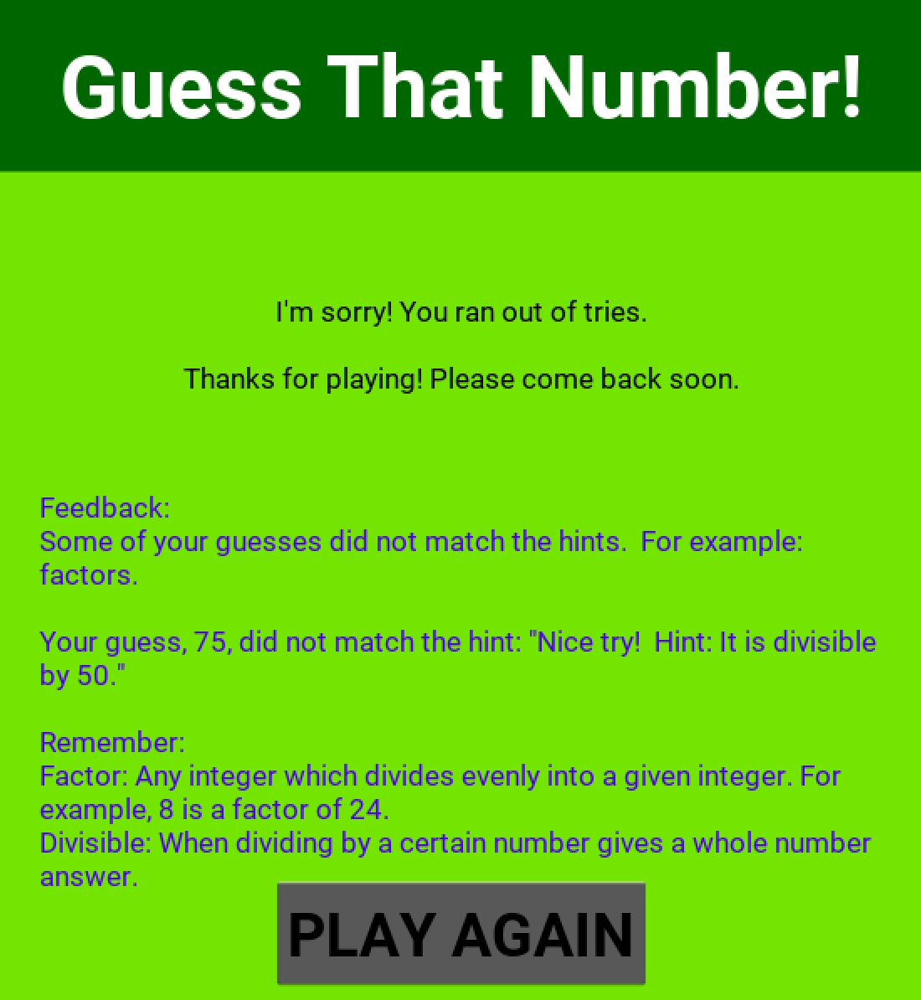
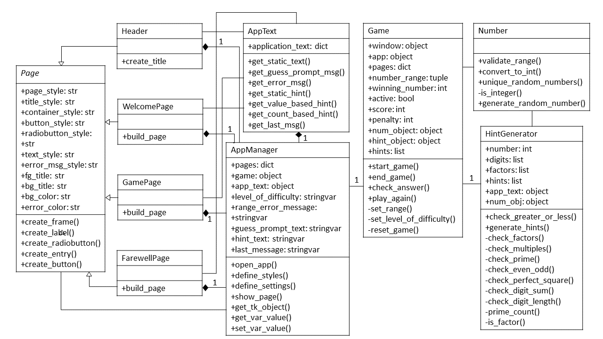

# Guess That Number

## Overview
Guess That Number is a game I built in Python.  The original version uses the Tkinter library, while the updated version uses Kivy.  The object of the game is to guess a number between a specific range in as few tries as possible, using the hints given.  It has 3 levels of difficulty and an ability to set a custom range if the user chooses.

  

## Files
Here are the relevant files for this application:
- [**README**](https://github.com/albert-ntiri/guess_that_number/blob/main/README.md): This file contains a high-level walkthrough of the project.

**VERSION 1**
- [**Guess_That_Number.ipynb**](https://github.com/albert-ntiri/guess_that_number/blob/main/version_1/Guess_That_Number.ipynb): This file contains the code for the application.  It is written in Jupyter Notebook.
- [**Guess_That_Number.py**](https://github.com/albert-ntiri/guess_that_number/blob/main/version_1/Guess_That_Number.py): This is the .py file for the application, which was used to create an executable.
- [**images**](https://github.com/albert-ntiri/guess_that_number/blob/main/version_1/images): This folder has screenshots of the application.

**VERSION 2**
- [**guess_that_number.py**](https://github.com/albert-ntiri/guess_that_number/blob/main/version_2/guess_that_number.py): This is the main .py file with the code to create the UI and logic to run the game.  There are also several other files with supporting classes.
- [**guess_that_number_design.kv**](https://github.com/albert-ntiri/guess_that_number/blob/main/version_2/guess_that_number_design.kv): This is the design file written in the Kivy language to define the widgets on each page and their layout.
- [**database_create_db.py**](https://github.com/albert-ntiri/guess_that_number/blob/main/version_2/database_create_db.py): This file contains the SQL query for creating the database used for the application.  There are also other database-related files for populating the database.

## Structure
This application has 3 pages:
- **Welcome Page**: This is the landing page for the game.  It consists of a description for the game, options for selecting a level of difficulty or inputting a custom range, and a play button to start the game.

   

- **Game Page**: This is the page the user sees while actively playing the game.  It consists of text indicating the range containing the winning number, an entry box for the user to type a number, hints that display if the user guesses incorrectly, and buttons to submit their guess or quit the game.

   

- **Farewell Page**: This is the final page the user sees once the game has ended.  It consists of a message that displays based on the outcome of the game and a button to play again if the user chooses.

   

## Code Structure
The code follows an object-oriented programming format.  Version 1 consists of 10 classes.  *Note: The sections below describe the classes in version 1.  Version 2 has some changes in the classes.*

### UML Class Diagram

  

### Class Descriptions
Here is a brief description of each class:
- **Number**: This class validates user entries from both the custom range and guess fields to determine whether they are integers and if the range is ordered properly.  It also generates random numbers, which are used to select a winning number and pick some of the hints.
- **HintGenerator**: This class takes the winning number and uses it to generate a list of hints.  These hints include but are not limited to prime numbers, factors, multiples, and characteristics about the digits.
- **Page**: This class serves as a toolkit with methods used to create widgets and a list of attributes defining the styles and colors to be used on the application.
- **Header**: This class uses methods inherited from the Page class to specify each widget on the header along with its size and location.
- **WelcomePage**: This class uses methods inherited from the Page class to specify each widget on the Welcome Page along with its size and location.
- **GamePage**: This class uses methods inherited from the Page class to specify each widget on the Game Page along with its size and location.
- **FarewellPage**: This class uses methods inherited from the Page class to specify each widget on the Farewell Page along with its size and location.
- **AppText**: This class serves as a centralized location for the text displayed on the application.  It contains a dictionary attribute with all of that text, along with methods for other classes to retrieve specific text.
- **AppManager**: This class builds the header and all of the pages.  It specifies the styles of the widgets, assigns those styles and the colors to different widgets, configures the buttons with their commands and text variables with their label widgets, and manages which page shows on the screen.
- **Game**: This class operates the game from setting it up and starting it, to verifying answers and providing hints, to ending it and determining the final score.

## Process
To develop this app, I followed a process that included 4 main steps:
1. Develop the back end.
2. Design the front end.
3. Connect the front and back ends.
4. Refactor.

### 1. Develop the back end.
The first step was figuring out how the game was going to work.  During this step, I laid out 2 classes: 1 for carrying out the logic of the game and 1 for generating the hints.  The logic of the game included setting a range, picking a winning number, checking answers, and establishing a scoring system, resulting in the Game class.  I put the logic for generating hints into a separate class because there were a variety of ways to come up with a hint, which could result in a lot of code just for hints so I thought it best to isolate that in its own class.

### 2. Design the front end.
Once I established the logic for the game, I proceeded to build an interface for it.  This began with conceptualizing the number of pages and how each page might look, and then proceeding to build each one separately.  The design was based on how the game works.  For example, at minimum, there needed to be a button to start the game, along with one for submitting a guess.  Similarly, there needed to be an entry field where users could type in their guess, along with text displaying the range to guess from and the hints as they were provided.

### 3. Connect the front and back ends.
After finishing the back end and front end logic, separately, the next step was to figure out how to get them to work together.  This included things like getting the application to show the next page at the appropriate time, getting the right text to display when and where it was supposed to, and laying out the process for opening and playing the game in such a way that there were no dependency issues.  During this step, I also converted the logic from step 2 into object-oriented programming format.  This resulted in the Page, WelcomePage, GamePage, FarewellPage, and AppManager classes.

### 4. Refactor.
At this point, I was able to run the game successfully without any major bugs preventing a full game from being played.  From there, I went back and relooked at everything, searching for ways to make it better, more efficient, and more reliable.  In this step, I identified operations I was performing multiple times in different places and turned them into methods.  I also discovered opportunities to add new attributes that simplified the logic of some of the methods, making them more clean and readable.  I also cleaned up the pages but separating the header into its own class and made the decision to move all of the text to a centralized location instead of hardcoding it in various places.  This resulted in the Number, Header, and AppText classes.

## Testing
Testing was a major component of developing this application.  I tested it manually, which included a series of steps, starting from the micro-level and gradually increasing the scope.

### Unit Testing
At the lowest level, I verified each individual piece of functionality one by one to make sure it was working.  This included every attribute and method of each class.  If a method was not behaving as expected, I sometimes converted it into a function outside of the class to get it working before returning to the method.

### Methods That Call Other Methods or Use Multiple Attributes Within a Class
Once everything was working on the micro level, I tested more complex methods, either because they used multiple attributes or called other methods from that class.  From there, I continued this process until I reached the highest-level methods within each class.

### Interaction Between Classes
After I tested everything within each class, the next step was to focus on interactivity between classes.  This primarily composed of 2 things: methods that accessed an attribute from a different class and methods that called a method from a different class.  Much of connecting the front and back ends fell into this step.

### Running the Whole Game
Finally, I ran the whole game several times, looking at everything in context.  This step required running through multiple scenarios:
- Checking each level of difficulty
- Trying out different custom ranges
- Purposefully inputting invalid entries to verify the appropriate error was being displayed
- Winning, losing, and quitting the game to see each experience in action
- Getting different types of winning numbers and verifying the accuracy and utility of the hints.

Most of the refactoring ideas emerged from this step.
